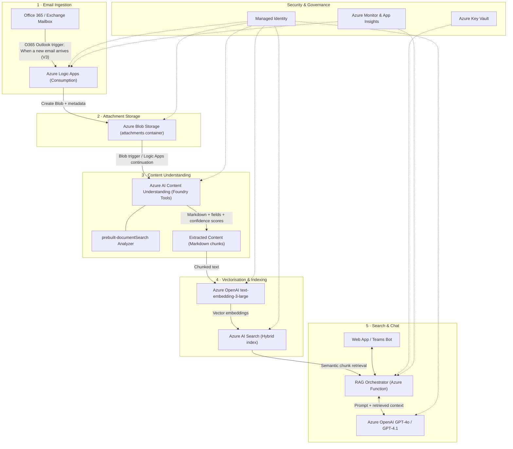

# Email Attachment Scanner Architecture

> Ingest email attachments, process them with Azure AI Content Understanding, make them searchable via Azure AI Search, and enable conversational chat with Azure OpenAI.

---

## Architecture Overview



---

## Component Details

### 1. Email Ingestion — Azure Logic Apps + Office 365 Outlook Connector

| Setting | Value |
|---|---|
| **Trigger** | `When a new email arrives (V3)` (Operation ID: `OnNewEmailV3`) |
| **Filter** | `fetchOnlyWithAttachment = true` — only fires for emails with attachments |
| **Attachment handling** | Set `includeAttachments = true` to get base64 content in the trigger payload |
| **Shared mailbox** | Use `When a new email arrives in a shared mailbox (V2)` if scanning a shared/service mailbox |

**What the Logic App does per email:**
1. Fires on new email with attachment(s)
2. For each attachment, creates a blob in Azure Blob Storage with metadata (sender, subject, received date, original filename)
3. Optionally stores the email body as a separate blob for context
4. Triggers the Content Understanding processing pipeline (inline or via Event Grid)

**Key docs:** [Office 365 Outlook connector reference](https://learn.microsoft.com/en-us/connectors/office365/) · [Logic Apps quickstart](https://learn.microsoft.com/en-us/azure/logic-apps/quickstart-create-example-consumption-workflow)

---

### 2. Attachment Storage — Azure Blob Storage

| Config | Recommendation |
|---|---|
| **Container** | `email-attachments` with folder structure: `{year}/{month}/{messageId}/` |
| **Access tier** | Hot (frequent read during processing) |
| **Metadata** | Store `sender`, `subject`, `receivedDate`, `originalFileName`, `contentType` as blob metadata |
| **Lifecycle** | Move to Cool tier after 30 days, Archive after 90 days |
| **Security** | Managed Identity access only — no shared keys |

---

### 3. Content Processing — Azure AI Content Understanding (Foundry Tools)

This is the core intelligence layer. Content Understanding (GA, API `2025-11-01`) extracts structured content from attachments using **analyzers**.

#### Recommended Analyzer: `prebuilt-documentSearch`

This RAG-optimized prebuilt analyzer:
- Extracts content and layout elements (paragraphs, tables, figures) as **Markdown**
- Generates **figure descriptions** (textual explanations of charts, diagrams, images)
- Analyzes charts → `chart.js` syntax, diagrams → `mermaid.js` syntax
- Captures handwritten annotations and markup
- Generates a **one-paragraph summary** of the entire document
- Supports PDF, images, Office documents, and text files

#### Processing Pipeline

```python
from azure.identity import DefaultAzureCredential, get_bearer_token_provider

credential = DefaultAzureCredential()
token_provider = get_bearer_token_provider(
    credential, "https://cognitiveservices.azure.com/.default"
)

# Create Content Understanding client
client = AzureContentUnderstandingClient(
    endpoint=AZURE_AI_SERVICE_ENDPOINT,
    api_version="2025-11-01",
    token_provider=token_provider,
)

# Analyze the attachment using the prebuilt RAG analyzer
response = client.begin_analyze("prebuilt-documentSearch", blob_url)
result = client.poll_result(response)

# result["result"]["contents"] contains:
#   - markdown: structured text representation
#   - fields: AI-generated metadata (summary, key topics)
#   - confidence scores and grounding spans
```

#### Other Analyzers by Attachment Type

| Attachment Type | Analyzer | What It Extracts |
|---|---|---|
| **Documents** (PDF, DOCX, PPTX) | `prebuilt-documentSearch` | Markdown + figures + tables + summary |
| **Images** (PNG, JPG) | `prebuilt-imageSearch` | Image description + OCR text + summary |
| **Audio** (MP3, WAV) | `prebuilt-audioSearch` | Transcription + conversation summary |
| **Video** (MP4) | `prebuilt-videoSearch` | Scene descriptions + transcript + segment summaries |
| **Invoices** | `prebuilt-invoice` | Vendor, line items, amounts, dates |
| **Contracts** | `prebuilt-contract` | Parties, terms, obligations |

**Key docs:** [Content Understanding overview](https://learn.microsoft.com/en-us/azure/ai-services/content-understanding/overview) · [Prebuilt analyzers](https://learn.microsoft.com/en-us/azure/ai-services/content-understanding/concepts/prebuilt-analyzers) · [RAG tutorial](https://learn.microsoft.com/en-us/azure/ai-services/content-understanding/tutorial/build-rag-solution)

---

### 4. Vectorisation & Indexing — Azure OpenAI Embeddings + Azure AI Search

#### Embedding

```python
from langchain_openai import AzureOpenAIEmbeddings

embeddings = AzureOpenAIEmbeddings(
    azure_deployment="text-embedding-3-large",
    openai_api_version="2024-08-01-preview",
    azure_endpoint=AZURE_OPENAI_ENDPOINT,
    azure_ad_token_provider=token_provider,
)
```

#### Azure AI Search Index Schema

```json
{
  "name": "email-attachments-index",
  "fields": [
    { "name": "id", "type": "Edm.String", "key": true },
    { "name": "content", "type": "Edm.String", "searchable": true },
    { "name": "content_vector", "type": "Collection(Edm.Single)", "dimensions": 3072, "vectorSearchProfile": "default" },
    { "name": "summary", "type": "Edm.String", "searchable": true },
    { "name": "sender", "type": "Edm.String", "filterable": true, "facetable": true },
    { "name": "subject", "type": "Edm.String", "searchable": true },
    { "name": "received_date", "type": "Edm.DateTimeOffset", "filterable": true, "sortable": true },
    { "name": "filename", "type": "Edm.String", "searchable": true },
    { "name": "file_type", "type": "Edm.String", "filterable": true, "facetable": true },
    { "name": "blob_url", "type": "Edm.String" },
    { "name": "page_number", "type": "Edm.Int32", "filterable": true },
    { "name": "confidence", "type": "Edm.Double" }
  ],
  "vectorSearch": {
    "algorithms": [{ "name": "hnsw", "kind": "hnsw" }],
    "profiles": [{ "name": "default", "algorithm": "hnsw" }]
  },
  "semantic": {
    "configurations": [{
      "name": "default",
      "prioritizedFields": {
        "contentFields": [{ "fieldName": "content" }],
        "titleField": { "fieldName": "subject" }
      }
    }]
  }
}
```

**Search capabilities:**
- **Hybrid search** — combines vector similarity (semantic meaning) with BM25 keyword matching
- **Semantic ranker** — re-ranks results for higher relevance
- **Filters** — by sender, date range, file type, confidence threshold
- **Facets** — browse by sender, file type

---

### 5. Search & Chat — RAG with Azure OpenAI

#### RAG Orchestrator (Azure Function or App Service)

```python
from langchain_openai import AzureChatOpenAI
from langchain_core.prompts import ChatPromptTemplate
from langchain.schema import StrOutputParser
from langchain.schema.runnable import RunnablePassthrough

prompt = ChatPromptTemplate.from_template("""
You are an assistant that answers questions about email attachments.
Use the retrieved context to answer. If you don't know, say so.
Always cite the source document filename and sender.

Question: {question}
Context: {context}
Answer:
""")

llm = AzureChatOpenAI(
    azure_deployment="gpt-4o",
    openai_api_version="2024-08-01-preview",
    azure_ad_token_provider=token_provider,
    temperature=0.3,
)

retriever = vector_store.as_retriever(search_type="similarity", k=5)

rag_chain = (
    {"context": retriever | format_docs, "question": RunnablePassthrough()}
    | prompt
    | llm
    | StrOutputParser()
)
```

**Example user queries:**
- *"What invoices did we receive from Contoso last month?"*
- *"Summarize the contract attachment from the legal team"*
- *"Find all spreadsheets with budget figures over $100k"*
- *"What did the Q3 earnings report say about revenue growth?"*

---

## Azure Resources Required

| Resource | SKU / Tier | Purpose |
|---|---|---|
| **Azure Logic Apps** | Consumption | Email trigger + orchestration |
| **Azure Blob Storage** | Standard LRS, Hot | Attachment storage |
| **Microsoft Foundry Resource** | Standard | Hosts Content Understanding |
| **Azure OpenAI** | Standard | `text-embedding-3-large` + `gpt-4o` deployments |
| **Azure AI Search** | Standard (S1+) | Hybrid vector + keyword index |
| **Azure Functions** | Flex Consumption | RAG orchestrator API |
| **Azure Key Vault** | Standard | Secrets management |
| **Azure Monitor** | — | Logging, metrics, alerts |

---

## Security Considerations

| Concern | Mitigation |
|---|---|
| **Authentication** | Managed Identity everywhere — no API keys in code |
| **Network** | Private endpoints for Storage, Search, OpenAI, Content Understanding |
| **Data at rest** | Azure Storage encryption (Microsoft-managed or CMK via Key Vault) |
| **Data in transit** | TLS 1.2+ enforced on all services |
| **Email permissions** | Logic Apps connector uses delegated OAuth or service principal with least-privilege Graph API scopes (`Mail.Read`) |
| **Content safety** | Content Understanding includes built-in Azure AI Content Safety filtering |
| **RBAC roles** | `Storage Blob Data Contributor`, `Cognitive Services User`, `Search Index Data Contributor`, `Cognitive Services OpenAI User` |

---

## Processing Flow (Step by Step)

1. **Email arrives** → Logic Apps O365 trigger fires (only for emails with attachments)
2. **Extract attachments** → Logic Apps iterates over `attachments[]`, writes each to Blob Storage with email metadata
3. **Content Understanding** → triggered via Logic Apps continuation or Event Grid; runs `prebuilt-documentSearch` analyzer against the blob
4. **Extract & chunk** → Content Understanding returns Markdown + fields + confidence scores; application chunks the markdown by headers/sections
5. **Embed** → Each chunk is sent to `text-embedding-3-large` to generate a 3072-dimension vector
6. **Index** → Chunks + vectors + metadata are upserted into Azure AI Search hybrid index
7. **User queries** → User asks a question via Web App or Teams Bot
8. **Retrieve** → RAG orchestrator runs hybrid search (vector + keyword) in Azure AI Search, retrieves top-k relevant chunks
9. **Generate** → Retrieved chunks are injected as context into a GPT-4o prompt; model generates a grounded answer with source citations
10. **Respond** → Answer returned to the user with links to original attachments in Blob Storage

---

## References

- [Azure AI Content Understanding — Overview](https://learn.microsoft.com/en-us/azure/ai-services/content-understanding/overview)
- [Content Understanding — Build a RAG Solution Tutorial](https://learn.microsoft.com/en-us/azure/ai-services/content-understanding/tutorial/build-rag-solution)
- [Content Understanding — Prebuilt Analyzers](https://learn.microsoft.com/en-us/azure/ai-services/content-understanding/concepts/prebuilt-analyzers)
- [Office 365 Outlook Connector Reference](https://learn.microsoft.com/en-us/connectors/office365/)
- [Azure AI Search — Vector Search](https://learn.microsoft.com/en-us/azure/search/vector-search-overview)
- [RAG Python Code Samples (GitHub)](https://github.com/Azure-Samples/azure-ai-search-with-content-understanding-python)
- [Content Processing Solution Accelerator (GitHub)](https://github.com/microsoft/content-processing-solution-accelerator)
